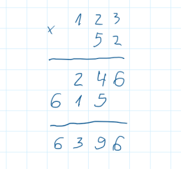
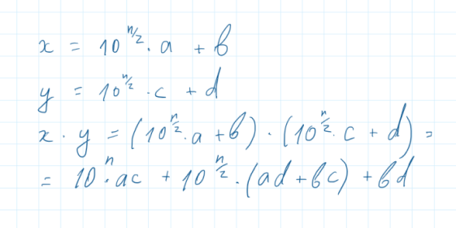
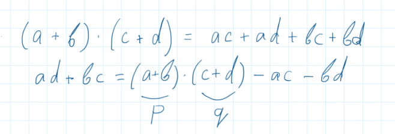

# Algorithms Illuminated. The basics.

## 1 Introduction

### Определения

***Что такое алгоритм***  
Это набор правил, рецепт для решения вычислительной задачи.

***Что такое сложность алгоритма***  
Это кол-во примитивных операций, выполняемых алгоритмом, в зависимости от входных данных.

***Divide-and-conquer***
Это алгоритмический подход, при котором задача разбивается на несколько меньших подзадач, которые решаются рекурсивно.
В конце результаты подзадач объединяются в решение изначальной задачи.

## 1.2.3 Grade-School multiplication

### Задача

Школьный способ умножения двух чисел столбиком.

> Input:  
> Два N-значных не отрицательных числа X и Y
>
> Output:  
> Результат умножения X и Y

### Решение



### Сложность

Расчитаем сложность в зависимости от длинны числа N.  
o(N) = N^2

| Шаг | Сложность |
| --- | --------- |
| Умножаем X на одну цифру Y | 2N |
| Повторяем для всех цифр из Y | N * 2N |
| Складываем два результата | 2N |
| Повторяем для всех результатов | N * 2N |
| Итого | 2N^2 + 2N^2 |

## 1.3.2  Recursive multiplication

Разбиваем каждое число на две половинки.  
Вычисляем результат умножая и складывая эти половинки.  
Умножение половинок выполняется рекурсивно.

Что-бы не выделять память в куче при каждом рекурсивном вызове, выделяется один большой буфер на старте алгоритма. Первая половина буфера служит для хранения возвращаемого результата.
Вторая половина используется вычислений вычислений.

### Задача

> Input:  
> Два N-значных не отрицательных числа X и Y
>
> Output:  
> Результат умножения X и Y
>
> Assumptions:  
> N - кратно 2

### Решение

```text
if n = 1 then 
  вычислить X * Y за одну операцию в вернуть результат
else
  a, b := первая и вторая половины X
  с, d := первая и вторая половины Y
  рекурсивно вычисляем 
    ac := a * c
    ad := a * d
    bc := b * d
    bd := b * d
  вычисляем результат используя школьное сложение
    10^N * ac + 10^(N/2) * (ad + bc) + bd
```

### Доказательство



### Сложность

TODO

## 1.3.3  Karatsuba multiplication

Оптимизация для Recursive multiplication.
Заменяем 4 умножения на 3.

### Задача

> Input:  
> Два N-значных не отрицательных числа X и Y
>
> Output:  
> Результат умножения X и Y
>
> Assumptions:  
> N - кратно 2

### Решение

```text
if n = 1 then 
  вычислить X * Y за одну операцию в вернуть результат
else
  a, b := первая и вторая половины X
  с, d := первая и вторая половины Y
  вычисляем используя школьное сложение
    p := a + b
    q := c + d
  рекурсивно вычисляем
    ac := a * c
    bd := b * d
    pq := p * q
  вычисляем используя школьное сложение
    abdc := pq - ac - bd
  вычисляем результат используя школьное сложение
    10^N * ac + 10^(N/2) * adbc + bd
```

### Доказательство

Заменяем два умножения на одно новое и два уже выполненных умножения.


### Сложность

TODO

## 1.2.3 MergeSort

Популярный алгоритм созданный John Fon Neumann в 1945 году.

### Задача

> Input:  
> Массив A из N-чисел в случайном порядке
>
> Output:  
> Массив из тех же N-чисел, упорядоченных от меньших к большим

### Решение

```text
  C := рекурсивно отсортированная первая половина A
  D := рекурсивно отсортированная вторая половина A
  return Merge(C, D)
```

TODO:
Алгоритмы сортировки с квадратичной сложностью:
selection sort - находим самый маленький элемент; помещаем в начало; повторяем рекурсивно
insertion sort - эффективна на небольших данных
buble sort - приводим к упорядоченности смежные пары чисел. повторяем до полной сортировки.
