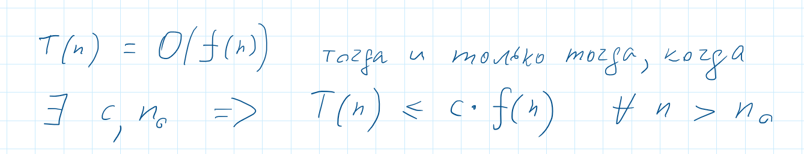
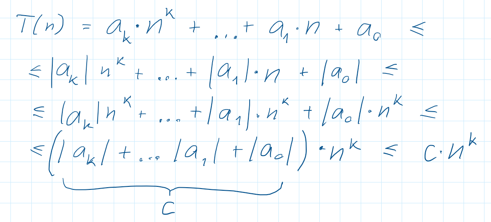
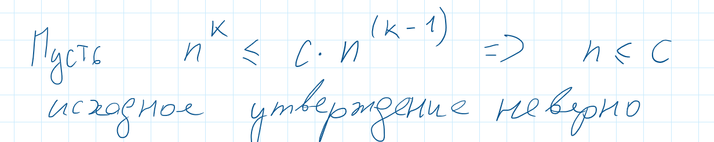
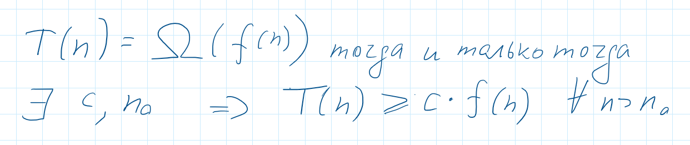
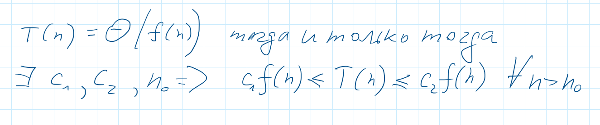
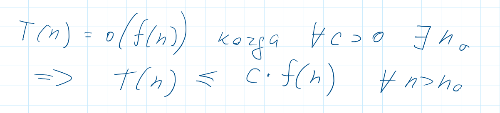
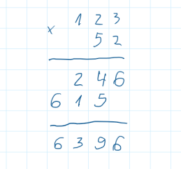
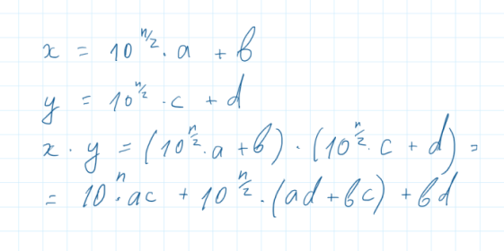
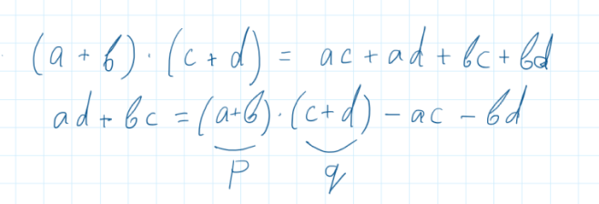
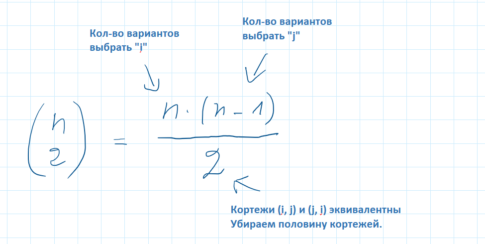

# Algorithms Illuminated. The basics.

***Что такое алгоритм***  
Это набор правил, рецепт для решения вычислительной задачи.

***Что такое сложность алгоритма***  
Это кол-во примитивных операций, выполняемых алгоритмом, в зависимости от входных данных.

## Асимптотический анализ

***Worst-Case analysis***  
Определяет границу выполнения алгоритма даже при самом неудачном варианте входных данных. Другой вариант это анализ по "benchmark instances", когда проверяем на реальных данных из предметной области.

Обычно, этот подход проще рассчитывать математически.

***Big picture analysis***  
Можно пренебречь небольшими постоянными величинами или переменными меньшего порядка для оценки границы выполнения алгоритма.  

Этот подход позволяет упростить математические расчеты производительности.

***Asymptotic analysis***  
Фокус на скорости роста времени выполнения алгоритма при больших значениях N.

При небольших N любой алгоритм сортировки справится практически мгновенно. Если возникает вопрос к сложности алгоритма, значит N большое число.

***Fast algorithm***  
Быстрый алгоритм, это алгоритм для которого худшее время выполнения растет медленно с ростом размера ввода.

***For-free primitive***  
Алгоритм линейной сложности считается бесплатным. Это сравнимо с простым чтением всех элементов ввода.

***Asymptotic notation***

Suppress *constant factors* and *low-order terms*.  
*Constant factor* is system dependent.  
*Low-order terms* is irrelevant for large numbers.  

## Нотация

***Bit-O notation***  

Определение нотации Big-O:


***Полиномы степени K имеют сложность O(n^K)***  

Доказательство ограничения полинома сверху:


Доказательство ограничения полинома снизу (от обратного):



***Big-Omega notation***

Определение нотации Bit-Omega:


***Big-Theta notation***

Определение нотации Bit-Theta:


Определение нотации Little-O:


## Divide-and-Conquer

Это алгоритмический подход, при котором задача разбивается на несколько меньших подзадач. В конце результаты подзадач объединяются.

Шаги:

1. Разбить входные данные на меньшие подзадачи
1. Решить подзадачи
1. Объединить решения подзадач с решение оригинальной задачи

## 1.2.3 Grade-School multiplication

### Задача

Школьный способ умножения двух чисел столбиком.

> Input:  
> Два N-значных не отрицательных числа X и Y
>
> Output:  
> Результат умножения X и Y

### Решение



### Сложность

Расчитаем сложность в зависимости от длинны числа N.  
o(N) = N^2

| Шаг | Сложность |
| --- | --------- |
| Умножаем X на одну цифру Y | 2N |
| Повторяем для всех цифр из Y | N * 2N |
| Складываем два результата | 2N |
| Повторяем для всех результатов | N * 2N |
| Итого | 2N^2 + 2N^2 |

## 1.3.2  Recursive multiplication

Разбиваем каждое число на две половинки.  
Вычисляем результат умножая и складывая эти половинки.  
Умножение половинок выполняется рекурсивно.

Что-бы не выделять память в куче при каждом рекурсивном вызове, выделяется один большой буфер на старте алгоритма. Первая половина буфера служит для хранения возвращаемого результата.
Вторая половина используется вычислений вычислений.

### Задача

> Input:  
> Два N-значных не отрицательных числа X и Y
>
> Output:  
> Результат умножения X и Y
>
> Assumptions:  
> N - кратно 2

### Решение

```text
if n = 1 then 
  вычислить X * Y за одну операцию в вернуть результат
else
  a, b := первая и вторая половины X
  с, d := первая и вторая половины Y
  рекурсивно вычисляем 
    ac := a * c
    ad := a * d
    bc := b * d
    bd := b * d
  вычисляем результат используя школьное сложение
    10^N * ac + 10^(N/2) * (ad + bc) + bd
```

### Доказательство



### Сложность

TODO

## 1.3.3  Karatsuba multiplication

Оптимизация для Recursive multiplication.
Заменяем 4 умножения на 3.

### Задача

> Input:  
> Два N-значных не отрицательных числа X и Y
>
> Output:  
> Результат умножения X и Y
>
> Assumptions:  
> N - кратно 2

### Решение

```text
if n = 1 then 
  вычислить X * Y за одну операцию в вернуть результат
else
  a, b := первая и вторая половины X
  с, d := первая и вторая половины Y
  вычисляем используя школьное сложение
    p := a + b
    q := c + d
  рекурсивно вычисляем
    ac := a * c
    bd := b * d
    pq := p * q
  вычисляем используя школьное сложение
    abdc := pq - ac - bd
  вычисляем результат используя школьное сложение
    10^N * ac + 10^(N/2) * adbc + bd
```

### Доказательство

Заменяем два умножения на одно новое и два уже выполненных умножения.


### Сложность

TODO

## 1.2.3 MergeSort

Популярный алгоритм созданный John Fon Neumann в 1945 году.

### Задача

> Input:  
> Массив A из N-чисел в случайном порядке
>
> Output:  
> Массив из тех же N-чисел, упорядоченных от меньших к большим

### Решение

```text
  C := рекурсивно отсортированная первая половина A
  D := рекурсивно отсортированная вторая половина A
  return Merge(C, D)
```

Merge шаг для двух половинок:

```C#
i := 1
j := 1
for k := 1 to n do
    if C[i] < D[j] then
        B[k] := C[i] // populate output array
        i := i + 1 // increment i
    else // D[j] < C[i]
        B[k] := D[j]
        j := j + 1
```

### Сложность

Кол-во операция при Merge шаге для двух массивов L/2  
4 * L + 2

Построим рекурсивное дерево для шагов алгоритма. Глубина дерева Log2(L).

Суммарно на каждом шаге дерева выполняем не более 6 * L операций.

Итого:  
Log2(L) *6L  
N* Log2(N)

## 3.2 Кол-во инверсий в массиве

Посчитать кол-во инверсий в массиве. Инверсия, это пара элементов в массиве, которые не упорядочены п возрастанию.

Максимальное кол-во инверсий:  

- Пусть массив упорядочен в обратном порядке
- Это максимальное кол-во инверсий
- Кол-во инверсий равно кол-ву вариантов (i, J)



Мотивация для инверсий:

- Пронумеровать 10 фильмов, которые нравятся
- Записать номера фильмов в массив, в порядке как нравится другому человеку
- Инверсии в массиве будут соответствовать расхождению в сравнении двух фильмов
- Чем меньше инверсий, тем более похожие вкусы в фильмах

**Collaborative filtering**  
Построение рекомендации через поиск пользователя с похожими предпочтениями. Похожесть можно вычислят через инверсии.

### Задача

> Input:  
> Массив A разных целых чисел
>
> Output:  
> Количество пар (i, j) индексов массива, для которых i < j и A[i] > A[j]

### Решение

### Сложность
